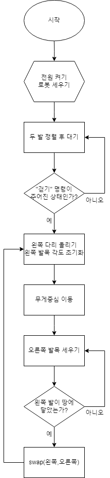
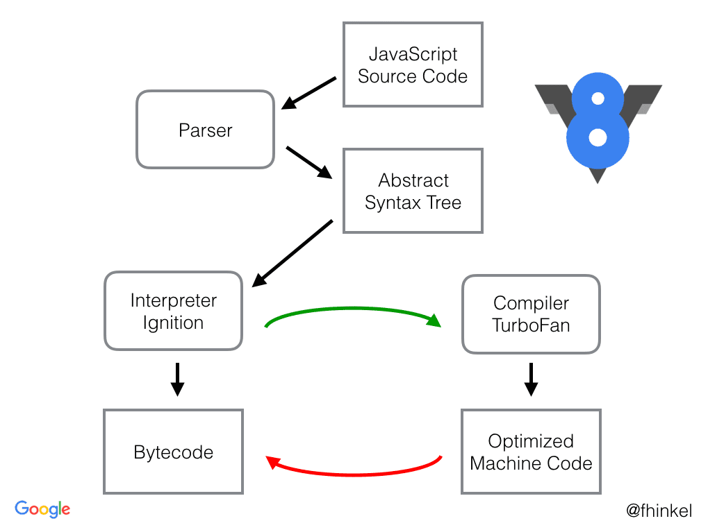

# 1주차 1차시

## 🐢

## 1장 프로그래밍

### 2족 보행 로봇 순서도



## 2장 JS란

### Ajax(Asynchronous Javascript And Xml)

→ 자바스크립트를 이용해 서버와 브라우저가 **[비동기 방식](https://www.notion.so/1-1-d6900a0eb3f04a7bae5fca508df42456?pvs=21)**으로 데이터를 교환할 수 있는 통신 기능

→ 클라이언트와 서버 간 XML데이터를 주고받는 기술

→ 자바스크립트의 라이브러리 중 하나로, 브라우저가 가지고 있는 XMLHttpRequest 객체를 이용해서 전체 페이지를 새로 고치지 않고 페이지의 일부만을 로드하는 기법

: 웹페이지 속도 향상, 처리가 완료될 때까지 기다리지 않고 처리가 가능

: 히스토리 관리가 되지 않음, 페이지 이동 없는 통신으로 인한 보안상의 문제가 있다

*비동기 방식

→ 웹페이지를 리로드 하지 않고 데이터를 불러오는 방식, Ajax를 통해 서버에 요청을 하더라도 멈춰있지 않고 해당 프로그램은 계속 돌아간다.

→ 시간 빠름, 화면을 리로드 하는 경우 전체 리소스를 다 가져올 필요 없이 일부 필요한 부분만 가져온다.

### jQuery

→ 자바스크립트를 쉽게 활용할 수 있도록 단순화시킨 오픈소스 기반의 자바스크립트 라이브러리

→ 거의 모든 웹 브라우저에 대응할 정도의 브라우저 호환성을 가짐

→ HTML의 [클라이언트 사이드](https://www.notion.so/1-1-d6900a0eb3f04a7bae5fca508df42456?pvs=21) 조작을 단순화 하도록 설계된 [크로스 플랫폼](https://www.notion.so/1-1-d6900a0eb3f04a7bae5fca508df42456?pvs=21)의 자바스크립트 라이브러리

*클라이언트 사이드

→ 네트워크의 한 방식인 클라이언트-서버 구조의 클라이언트 쪽에서 행해지는 처리

*크로스 플랫폼(멀티 플랫폼)

→ 컴퓨터 프로그램, 운영 체제, 컴퓨터 언어, 프로그래밍 언어, 컴퓨터 소프트웨어 등이 여러 종류의 컴퓨터 플랫폼에서 동작할 수 있다는 것을 뜻함

### V8 엔진 (자바스크립트 엔진)

→ 웹 브라우저를 만드는 데 기반을 제공하는 오픈 소스 자바스크립트 엔진

→ Google이 주도하여 C++로 개발한 오픈소스로 가장 대중적이다.

→ 구글 크롬 브라우저와 안드로이드 브라우저에 사용

### V8 엔진에 대해

→ 웹 브라우저 내부에서 자바스크립트 **수행 속도의 개선**을 목표로 고안됨

다른 자바스크립트 엔진은 즉시성 위해 인터프리터 방식 사용, 코드가 많아질수록 속도가 느려진다.
이를 보완하여 인터프리터 대신 JIT(Just In Time) 컴파일러를 구현. 코드 실행 시 코드를 머신 코드로 컴파일 함.

→ 자바스크립트를 **바이트코드(bytecode)**로 컴파일하고 실행하는 방식을 사용(JIT 컴파일)



### Nodejs

→ Chrome V8 JavaSccript 엔진으로 빌드된 JavaScript 런타임

→ 확장성 있는 네트워크 애플리케이션(ex. 서버 사이드) 개발에 사용되는 소프트웨어 플랫폼

→ JavaScript를 서버에서도 사용할 수 있도록 만든 프로그램(환경)

: 노드를 통해 다양한 자바스크립트 애플리케이션을 실행할 수 있으며, 서버를 실행하는 데 제일 많이 사용된다.

: 내장 HTTP 서버 라이브러리를 포함하고 있어 웹 서버에서 아파치 등의 별도 소프트웨어 없이 동작하는 것이 가능

### SPA(single Page Application) 프레임워크

→ 어떠한 웹 사이트의 전체 페이지를 하나의 페이지에 담아 동적으로 화면을 변경해 표시하는 기술(단일 페이지 애플리케이션)

→ 서버로부터 완전히 새로운 페이지를 불러오는 것이 아니라, 화면을 업데이트 할 때 필요한 데이터만 서버에서 전달 받아 브라우저에서 해당하는 부분만 업데이트하는 방식으로 작동하는 웹 애플리케이션, 웹 사이트

: 화면에 필요한 부분의 데이터만 받아 랜더링 하기에 빠르고 서버의 부담이 적다 (사용성 ↑)

: 자바스크립트로 DOM 조작이 빈번하게 일어나 브라우저의 성능 저하할 수 있음

## 4장 변수

### 아래의 코드들을 실행한 값과 그 이유

1번

```jsx
//입력
console.log(a);
var a;
a= 11;
console.log(a);
```

```jsx
//출력
undefined
11
```

2번

```jsx
//입력
console.log(a);
a = 10;
var a;
console.log(a);
```

```jsx
//출력
undefined
10
```

→ 둘 다 JS고유의 특징인 **변수 호이스팅** 때문이다.

소스 코드의 평가 과정에서 변수 선언을 포함한 모든 선언문을 소스 코드에서 찾아내 먼저 실행했기 때문에 오류가 나지 않고 undefined가 나오게 된다.

### 헝가리안 케이스(Hungarian Notation)

→ C언어 진영에서 주로 사용했던 방식으로 변수명의 앞에 자료형을 붙이는 것. 

C언어는 그 어떤 언어보다 사용자가 정의(메모리를 할당/해제 한다던지)를 하는 스타일이기 때문에 자료형이 명확한 것이 매우 중요하다.

```c
int intirstName;
```

단점: 변수명의 자료형이 바뀌게 된다면 다 뜯어 고쳐야 함……. 카멜이나 스네이크와 같은 표기법으로 넘어가는 추세