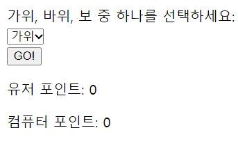
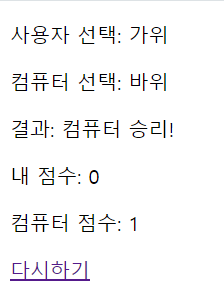
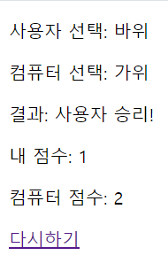

# 3주차 1차시


# 12장 함수

### 아래의 빈칸과 차이점 서술

```jsx
function add(x, y) { // x,y 을 뭐라하는가 인자(parameter)
return x + y;
}
add(2,5); // 들어가는 값에 대한 단어 : 인수(argument)
```

인자(매개변수, parameter): 함수에서 정의되어 사용되는 변수

인수(argument): 함수를 호출할 때 건네주는 변수, 전달되는 실질적인 값

### 본인이 생각하기에 이상적인 개발자란?

의사소통이 잘되는 개발자라고 생각한다. 지금은 혼자 알고리즘을 풀거나 코드를 짜는 일이 많지만 프로젝트의 규모가 커지면 협업을 하게 되는 것은 불가피한 일이다. 또한 남의 코드를 고치거나 자신의 코드를 보여주는 일도 적지 않을 것이다. 개인의 코딩 실력이 뛰어나도 서로 의사소통이 되지 않는다면 원하는 결과를 얻기는 어렵다.  또한 코딩 실력이 조금 부족하더라도 본인이 하고 싶은 것을 정확히 말하고 의견을 나누며 코드를 완성시켜 나갈 수 있을 것이다.

의사소통은 말에만 한정되지 않는다. 코드에서도 어떠한 목적으로 이러한 변수와 함수 등을 쓰게 되었는지 알아볼 수 있도록 코드를 짜는 것도 중요하다고 생각한다.

### 함수 이름을 생략하면 나오는 에러

```jsx
Uncaught SyntaxError: Function statements require a function name
```

### { }는 블록문일까 객체 리터럴일까?

블록문은 0개 이상의 구문을 묶을 때 사용하는 문이고 객체 리터럴은 객체를 선언하는 표기법을 뜻하며 프로퍼티를 정의한다.

함수에서 { }는 프로퍼티를 정의한다기보단 여러 코드를 묶는 역할을 하므로 블록문이라고 생각한다. 

리터럴* 사람이 이해할 수 있는 문자나 약속된 기호를 사용해 값을 생성하는 표기법

### 하단의 에러는 왜 날까?

```jsx
var add1 = (function() {
var a = 10;
return function (x, y){
return x + y + a;
};
}());
console.log(add1(1,2)); // 13
var add2 = (function() {
var a = 10;
return new Function('x', 'y', 'return x + y + a;')
}());
console.log(add2(1,2)); // ReferenceError: a is not defined
```

인수 a가 add2 함수 내에서 정의되지 않았기 때문이다. 

### 아래 함수를 실행해보고 결과 값을 적으시오.

```jsx
//코드 1
function add(x, y){
console.log(x,y);
return x+y;
}
add(2, 5);
console.log(x, y);
```

```jsx
2 5
7
Uncaught ReferenceError: x is not defined
```

```jsx
//코드 2
function add(x, y) {
return x + y;
}
console.log(add(2));
```

```jsx
NaN
```

```jsx
//코드 3
function add(x, y) {
console.log(arguments);
return x + y;
}
console.log(add(2,5,10));
```

```jsx
[Arguments] { '0': 2, '1': 5, '2': 10 }
7
```

### Call by Reference, Call by Value

- **Call by value(값에 의한 호출)**
    
    복사된 값을 인자로 넘겨서 매개변수로 전달
    
    JS - 원시타입
    
    - 장점: 복사하여 처리하기 때문에 안전. 원래의 값이 보존됨
    - 단점: 메모리 사용량이 늘어남

- **Call by reference(참조에 의한 호출)**
    
    주소값을 인자로 넘겨서 매개변수로 전달
    
    JS - 참조타입
    
    - 장점: 복사하지 않고 직접 참조를 해 빠름
    - 단점: 직접 참조를 하기에 원래 값이 영향을 받음

### 재귀함수로 팩토리얼 구현하기

```jsx
var factorial = function(n) {
	if (n <= 1) {
		return 1;
	}
	else {
		return n * factorial(n-1);
	}}

console.log(factorial(5)); //120
```

함수 factorial 선언 n을 인자로 받는다.

n * factorial(n-1)를 반환한다.

인자가 1이 되면 1을 반환한 후 탈출한다.

### 콜백지옥 만들기

```jsx
function replay1(n,callback,re2,re3,re4,re5,re6) {
	 ++n; callback(n,re2,re3,re4,re5,re6);
}

function replay2(n,callback,re3,re4,re5,re6) {
	++n; callback(n,re3,re4,re5,re6);
}

function replay3(n,callback,re4,re5,re6) {
	++n; callback(n,re4,re5,re6);
}

function replay4(n,callback,re5,re6) {
	++n; callback(n,re5,re6);
}

function replay5(n,callback,re6) {
	++n; callback(n,re6);
}

function replay6(n,callback) {
	++n; callback(n);
}

function answer(n) {
	console.log(n);
}

replay1(0, replay2, replay3, replay4, replay5, replay6, answer);
```

콜백지옥이 위험한 이유: 가독성이 지옥이다

### 순수 함수, 비순수 함수

```jsx
var count = 0;
function increase(n) {
	return ++n;
}

count = increase(count);
console.log(count); //1

count = increase(count);
console.log(count); //2
```

= 순수 함수

함수 내의 인자에 입력받은 인수만 이용해 값을 생성한다 

```jsx
var count = 0;
function increase() {
	return ++count;
}

count = increase(count);
console.log(count); //1

count = increase(count);
console.log(count); //2
```

= 비순수 함수

외부 변수 count의 값을 직접 변경한다

# 추가 과제

### commonJS와 ES6 차이점

- **commonJS**
    - Node.js의 기본값
    - Node.js에 내장되어 있음.
    - 모듈 가져오기 `require()`
        - CommonJS를 사용하는 node.js문
        - 파일이 들어있는 곳에 남아있음
        - 프로그램의 어느 지점에서나 호출할 수 있다
    - 모듈 내보내기 `module.exports`
        - 특정 변수나 그 변수의 속성으로 내보낼 객체를 세팅해줘야 한다
- **ES6**
    - JS의 표준 → JS 모듈 시스템이 표준화되면서 도입
    - 재사용을 위해 JS코드를 캡슐화하는 형식
    - 대부분의 최신 웹 브라우저는 기본적으로 지원한다.
    - 모듈 가져오기 `import`
        - ES6에서만 사용
        - 항상 맨 위로 이동
        - 파일의 시작 부분에서만 실행할 수 있음. (import 전용 비동기 문법으로 파일 중간에서 모듈 불러오기 가능)
        - 사용자가 필요한 모듈만 선택하고 로드할 수 있기 때문에 더 선호됨.
        - require()보다 성능이 우수하고 메모리를 절약할 수 있음.
    - 모듈 내보내기 `export`
        - 명시적 선언

### 콜백지옥을 해결하기 위한 예방법/대책법

- Promise
    - 비동기 연산이 종료된 이후 결과를 알기 위해 사용하는 객체
    - 비동기 메서드를 동기 메서드처럼 값을 반환하게 할 수 있다.
    - then()과 catch() 메서드를 사용하여 비동기 작업의 성공과 실패를 처리할 수 있다.
- Async/Await
    - ES8에서 도입된 문법
    - Promise를 더 쉽고 편하게 다룰 수 있다
    - asnyn키워드를 이용해 언제나 promise를 반환
- 모듈화
    - 코드를 작은 함수나 모듈로 나누어서 콜백을 방지
    - 특정 작업을 처리하고, 필요한 경우에만 비동기 작업 수행
- 라이브러리 / 프레임워크 사용
    - 라이브러리나 프레임워크를 사용하여 비동기 코드 관리

### 120줄 이상 코드 짜기

function 사용해서 120줄 이상, 콜백함수, 재귀함수 들어가야함 화살표 생성방식 사용 (몇개는 return값을 주고 몇개는 return값을 주지 않음)

```jsx
//필요한 모듈 불러오기
const express = require('express');
const app = express();
const port = 9899;

//정적파일 불러오기
app.use(express.json());
app.use(express.urlencoded({ extended: true }));

//유저, 컴퓨터 점수
let userPoint = 0;
let computerPoint = 0;

// 입력 폼을 제공하는 라우트
app.get('/get', (req, res) => {
    const getHtml = `
        <!DOCTYPE html>
        <html>
        <head>
            <title>가위바위보 게임</title>
        </head>
        <body>
            <form action="/play" method="POST">
                <label for="userChoice">가위, 바위, 보 중 하나를 선택하세요:</label><br>
                <select name="userChoice">
                    <option value="가위">가위</option>
                    <option value="바위">바위</option>
                    <option value="보">보</option>
                </select><br>
                <input type="submit" value="GO!">
            </form>
            <p>유저 포인트: ${userPoint}</p>
            <p>컴퓨터 포인트: ${computerPoint}</p>
        </body>
        </html>
    `;
    res.send(getHtml);
});

// 컴퓨터 선택 (콜백 함수)
const computerChoice = (callback) => {
    const choices = ["가위", "바위", "보"];
    const randomIndex = Math.floor(Math.random() * 3);
    const computerChoice = choices[randomIndex];
    callback(computerChoice);
};

// 유저 vs 컴퓨터
const compareChoices = (userChoice, computerChoice) => {
    let result = "";

    if (userChoice === computerChoice) {
        result = "무승부입니다!";
    } 
    else if (
        (userChoice === "가위" && computerChoice === "보") ||
        (userChoice === "바위" && computerChoice === "가위") ||
        (userChoice === "보" && computerChoice === "바위")
    ) {
        result = "사용자 승리!";
        userPoint++;
    } 
    else {
        result = "컴퓨터 승리!";
        computerPoint++;
    }
    return result;
};

// 게임을 진행하는 함수
const playGame = (req, res) => {
    const userChoice = req.body.userChoice;

    // 컴퓨터 선택
    computerChoice((computerChoice) => {
        const result = compareChoices(userChoice, computerChoice);

        const postHtml = `
            <!DOCTYPE html>
            <html>
            <head>
                <title>가위바위보 결과</title>
            </head>
            <body>
                <p>사용자 선택: ${userChoice}</p>
                <p>컴퓨터 선택: ${computerChoice}</p>
                <p>결과: ${result}</p>
                <p>내 점수: ${userPoint}</p>
                <p>컴퓨터 점수: ${computerPoint}</p>
                <a href="/get">다시하기</a>
            </body>
            </html>
        `;
        res.send(postHtml);

        // 재귀 함수를 사용하여 게임 반복
        promptForUserChoice();
    });
};

// 사용자에게 선택을 받는 함수 (재귀 함수)
const promptForUserChoice = () => {
    // 사용자에게 선택 받기
    const userChoice = prompt("가위, 바위, 보 중 하나를 선택하세요.");
    if (userChoice === null) {
        // 사용자가 취소하면 게임 종료
        return;
    } 
    else {
        // 게임을 계속 진행
        playGame({
            body: {
                userChoice: userChoice
            }
        });
    }
};

// 게임 시작
app.post('/play', playGame);

app.listen(port, () => {
    console.log(`서버가 포트 ${port}에서 실행 중입니다`);
});

// http://localhost:9899/get
```





